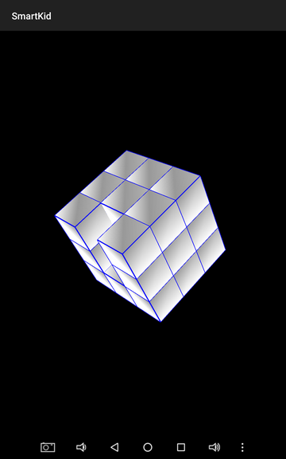

This is an educational application for my kids. It helps to develop mostly math
skills. The application is based on exercises kids perform during math classes.
It is going to be evolved until my last child graduates from the school :) It
doesn't make sense to describe the app in details because you can easily
understand everything while interacting with it in intuitive way. The only
thing which is worth mentioning that all content was generated by programs
written in C++ and they are not included in this repository.

